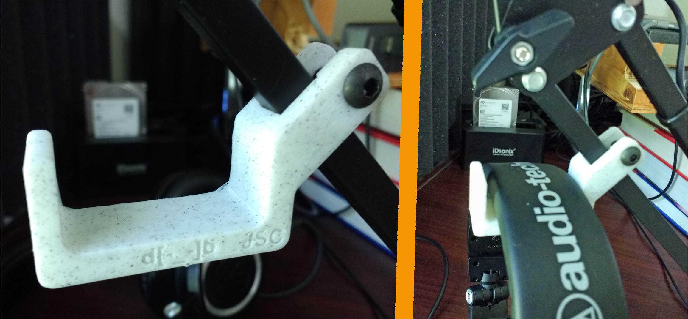

# Previous iteration using a screw to secure:

Tap smaller hole for 7/8 inch long 10-24 BHCS. STLs are for a 45° and 30° versions with the screw tap position reversed between the two.

Marble colored filament used: https://amzn.to/2KuEFxc

Used with this stand: https://amzn.to/31Be6fj 

With headphones: https://amzn.to/2H6Mx5R

Also seems to work with these lights FWIW: https://amzn.to/2KvluDi

Amazon links are affiliate
