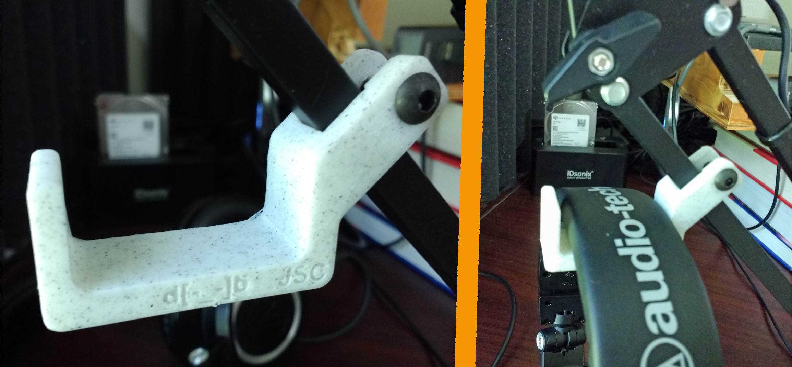
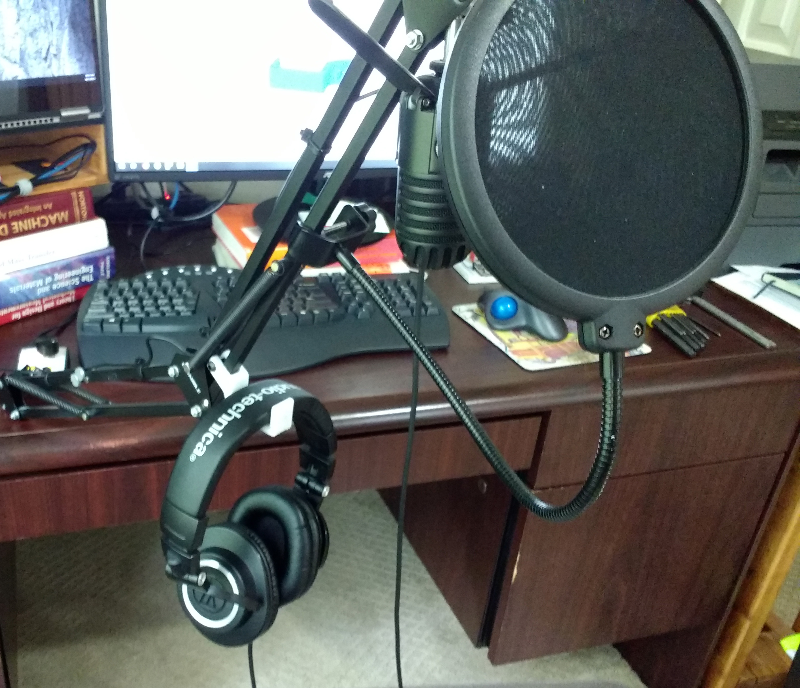

# HeadphoneHook
Hook for headphones that attaches to a movable stand

Tap smaller hole for 7/8 inch long 10-24 BHCS. STLs are for a 45° and 30° versions with the screw tap position reversed between the two.

Marble colored filament used: https://amzn.to/2KuEFxc

Used with this stand: https://amzn.to/31Be6fj 

With headphones: https://amzn.to/2H6Mx5R

Also seems to work with these lights FWIW: https://amzn.to/2KvluDi

As for what I record, check out [The Creativity Podcast: Where Art and Engineering Collide](https://soundcloud.com/thecreativitypodcast), 
or my [Projects Channel on YouTube](https://www.youtube.com/user/jscook55)

(links to Amazon are affiliate)
