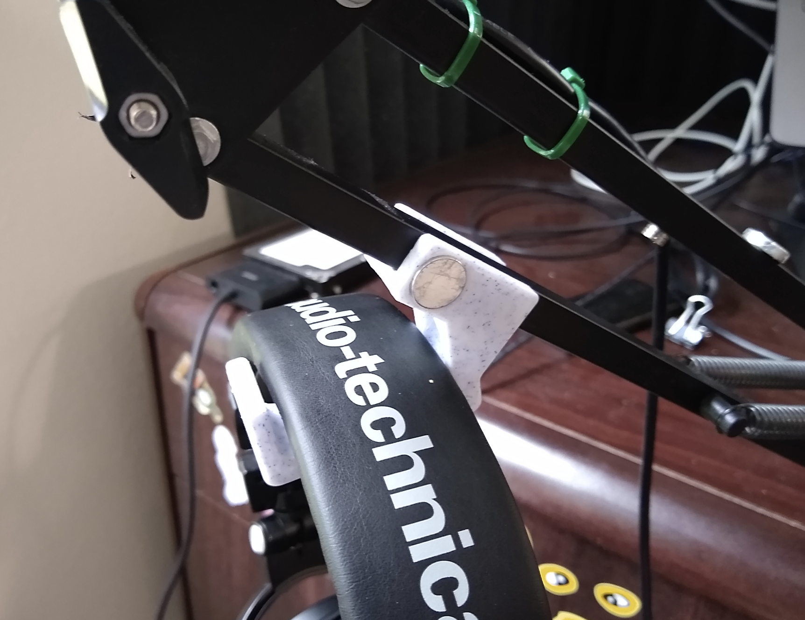

# HeadphoneHook

Earlier version seen demonstrated here: https://www.youtube.com/watch?v=KxgLdYH0gVc  
Hook for headphones that attaches to a movable stand

# Current magnet-based iteration:

Blue marble colored filament used: https://amzn.to/3gtnsVh  
12 x 3mm rare earth magnets: https://www.ebay.com/itm/lot-100-50-12mm-X-3mm-1-2-x-1-8-Neodymium-Disc-Strong-Rare-Earth-N52-Magnets/311723176686  
Used with this stand: https://amzn.to/31Be6fj  
With headphones: https://amzn.to/2H6Mx5R

As for what I record, check out [The Creativity Podcast: Where Art and Engineering Collide](https://www.youtube.com/channel/UC300jnYJu7u66EQX9S0SUZA)

or my [Projects Channel on YouTube](https://www.youtube.com/user/jscook55)

(links to Amazon are affiliate)
